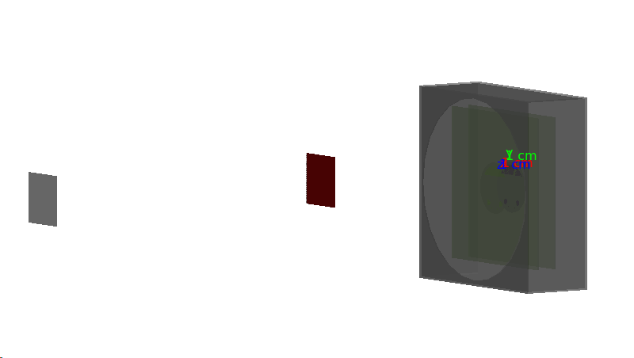

# FrascatiTestbeam
Geant4 simulation of the test beam setup in BTF 9-11 May 2022.

The source is based on the TestEm4 example, with the addition of hadronic physics list FTFP_BERT, the geometry of the experimental setup and the interface for the output data.

## Physics
Hadronic list FTFP_BERT.

## Geometry
The geometry contains the DUT box assembly without the top cover. The box is closed with a thin Al foil. There are the beam pipe exit window, the Fitpix detector and the DUT. Simulation in air.

## Data structure output
There are two TDirectory: histograms and ntuple.

### histograms
There are the following histograms
1. **primary**   Primary particle energy
2. **edepTotUp**   Energy/event deposited in the upstream sensor
3. **chargeUp**   Charge deposited in the pad upstream sensor
4. **primaryUp**   Track's energy entering upstream sensor
5. **edepTotLargeUp**   Energy/B deposited in the large pad 110 um sensor
6. **edepTotSmallUp**   Energy/B deposited in the small pad 110 um sensor
7. **edepTotDown**   Energy/event deposited in the downstream sensor
8. **chargeDown**   Charge deposited in the pad downstream sensor
9. **primaryDown**   Track's energy entering downstream sensor
10. **edepTotLargeDown**   Energy/B deposited in the large pad 150um sensor
11. **edepTotSmallDown**   Energy/B deposited in the small pad 150um sensor
12. **edepMapUp**   Spatial energy dep. distribution upstream sensor
13. **edepMapDown**   Spatial energy dep. distribution downstream sensor
14. **edepMapFitpix**   Spatial energy dep. distribution fitpix sensor

### ntuple
There are the following TTree in the ntuple directory
1. **DUTs** 
  Variables: (event, layer, edep, edepPosX, edepPosY, edepPosZ, wafer)
  Energy deposition from all steps in the sensitive volumes
2. **RUN**
  Variables: (event, etot, wafer)
  Energy/event deposited in the wafer
3. **AUX**
  Variables: (event, etotLP, etotSP)
  Energy/event deposited in the wafer but with position condition limited on the pad regions